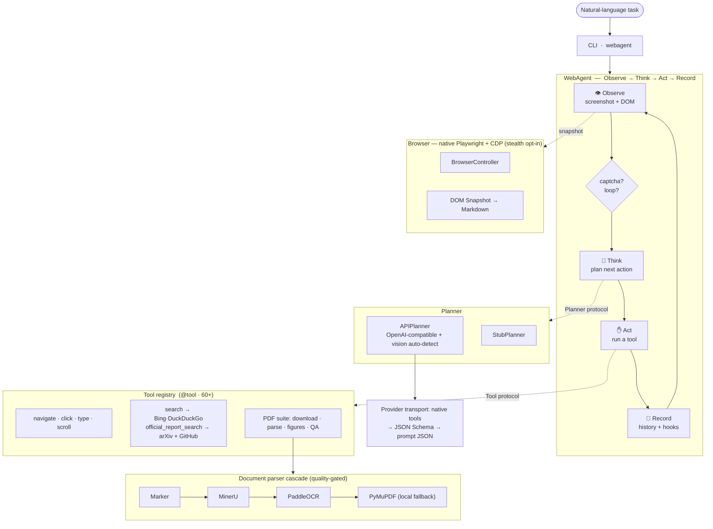
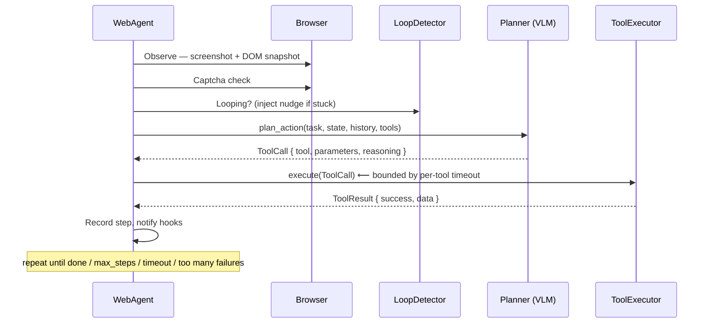
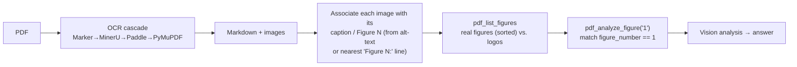

<div align="center">

# 🌐 webagent

**An autonomous, vision-language web agent that turns a natural-language instruction into a sequence of real browser actions — search, navigate, read PDFs, interpret figures, and report.**

[](LICENSE)
[](pyproject.toml)
[](tests/)
[](https://github.com/astral-sh/ruff)
[](https://mypy-lang.org/)

**English** · [简体中文](README.zh-CN.md)

</div>

---

## What is this?

`webagent` is a research-grade autonomous agent that drives a real Chromium browser to accomplish open-ended web tasks described in plain language — e.g. *"Find the most recent Qwen technical report and interpret Figure 1."* It fuses a **Vision-Language Model** (the screenshot it sees) with a **structured DOM snapshot** (the page it reads) to decide, step by step, which browser action to take next.

It is **model-agnostic** across OpenAI-compatible endpoints (with automatic vision detection and a local vLLM path) and ships a **document-intelligence pipeline** that parses PDFs through a cloud-OCR cascade, resolves *"Figure N"* by its real caption, and analyzes the figure with vision.

> A natural-language task in → a browser driven autonomously → a cited answer, the analyzed figure, and the extracted content out.

---

## ✨ Highlights

| Area | What makes it interesting |
|------|---------------------------|
| **Agentic core** | A clean **Observe → Think → Act → Record** loop built on `typing.Protocol` interfaces (`Planner`, `Tool`, `AgentHook`) — components are structurally typed and hot-swappable, no inheritance required. |
| **Multimodal planning** | Each step captures an ad-filtered DOM-to-Markdown snapshot and adaptively sends a JPEG screenshot for sparse or visual states. The planner **auto-probes** the endpoint for real vision support and silently degrades to text-only when a model can't see. |
| **Structured actions** | Provider-native function tools are the default. `auto` falls back only on an explicit capability error through provider JSON Schema and, finally, prompt JSON; all 60+ exposed tools have machine-readable parameter schemas. |
| **Robustness engineering** | Five-signal **loop detection**, bounded strategy switching/replanning, atomic resumable checkpoints, request/tool/task timeouts, malformed-output retries, consecutive-failure aborts, and per-attempt token/finish metadata. |
| **Resilient web search** | Browser search defaults to **Bing → Yahoo → DuckDuckGo**, records per-engine failures (`challenge`, selector drift, empty results, navigation), unwraps Yahoo result redirects, and cascades without inventing results. Ordinary runs also expose first-party report/GitHub/arXiv discovery; strict evaluation hides those shortcuts. |
| **Document intelligence** | A caption-grounded local vector/raster Figure fast path (with conservative cloud fallback), plus a quality-gated OCR cascade and optional content-addressed parse cache. |
| **Isolated browser/evaluation** | Persistent profiles remain available for signed-in work; temporary profiles and `--strict-eval` eliminate prior-session and PDF-cache state. Every run writes an auditable `trajectory/trace.json`. |
| **Two-layer evaluation** | Internal dated public-web, sandbox, and 60-stage suites provide diagnosis; BrowserGym adapters run WebArena-Verified Hard and full VisualWebArena as separately scored external evidence. Cross-layer readiness never averages unlike metrics. |
| **Engineering quality** | **60+ built-in tools**, branch coverage gated at **85%**, strict type-checking (`mypy`), and `ruff` linting/formatting. |

---

## 🏗️ Architecture

Everything hangs off three `Protocol`s — `Planner`, `Tool`, `AgentHook` — so the brain (LLM), the hands (tools), and the observers (hooks) are independently replaceable.



### Repository layout

```
src/webagent/
├── core/        # Protocols, Pydantic models, config (single source of truth)
├── agent/       # The loop, session history, lifecycle hooks, loop detector
├── browser/     # Playwright controller, stealth, CDP snapshot, captcha detector
├── planner/     # Stub & API planners, multi-provider adapters, prompt builders
├── parser/      # Cloud-OCR cascade (Marker/MinerU/Paddle) + local PyMuPDF, quality gate
├── tools/       # @tool registry + built-in tools (browser, search, pdf, file, task…)
├── evaluation/  # terminal-state assertions, runner, aggregate benchmark metrics
├── utils/       # PDF/image helpers, path containment
└── cli.py       # Entry point  →  `webagent`

benchmarks/
├── core/                         # Shared benchmark layout and helpers
├── environments/controlled_web/  # Reproducible local web environments
├── suites/                        # Internal suites + BrowserGym external adapter
└── studies/                       # Repeated, multi-model, longitudinal/two-layer studies

docs/research/     # Experiment lifecycle, evidence rules, and failure taxonomy
outputs/           # Gitignored workspace: runs/, studies/, campaigns/, and legacy/
```

---

## 🔄 How it works — one step of the loop



Without `--output`, the CLI allocates a unique run below
`outputs/runs/<UTC-date>/<model>/<task>-<run-id>/`. With `--output`, that path is the
exact run root. A run separates claims, evidence, controller state, and external
judgment:

```text
<run>/
├── manifest.json
├── trajectory/
│   ├── trace.json
│   ├── verification.json          # strict evaluation only
│   └── turns/turn-NNN.json        # immutable ordinary-session turn snapshots
├── observations/screenshots/
├── control/checkpoints/
│   ├── latest.json
│   └── latest.json.bak
├── artifacts/
│   ├── downloads/                 # acquired PDFs and other downloads
│   ├── documents/<doc-id>/        # content-addressed parse output
│   ├── figures/
│   └── files/
├── result/
│   ├── summary.txt
│   ├── attachments/
│   └── turns/turn-NNN/
│       ├── summary.txt
│       └── attachments/
└── evaluation/
```

`trajectory/` is observable execution evidence; `control/` is resumable state;
`artifacts/` contains acquired or derived task files; `result/` is the agent's claim;
and `evaluation/` is independent judgment. See
[the research workflow](docs/research/README.md) for the full artifact contract.
Optional namespaces are created on first write, so an absent directory means that the run
did not produce that class of evidence rather than leaving an empty placeholder.
An ordinary interactive session keeps one owned run: the canonical trace/result represent
the latest turn, while `trajectory/turns/` and `result/turns/` preserve immutable per-turn
snapshots with monotonic step numbers. Strict/search-only evaluation forbids multi-turn runs.

---

## 📑 Document intelligence: resolving *"Figure 1"* correctly

A recurring failure mode in naïve agents: *"Figure 1"* gets mapped to the **first image extracted** from the PDF — often a logo or cover decoration. webagent instead reads the parsed document and resolves figures **by their real caption / number**.



Logos and decorations are kept in a separate `unlabeled_images` bucket and never masquerade as numbered figures. Each provider in the cascade is tried in order; a **quality gate** rejects empty/degraded output and falls through to the next, with a local PyMuPDF extractor as the last resort so a result is always produced.

---

## 🚀 Quick start

```bash
# 1. Install
pip install -e ".[dev]"
playwright install chromium

# 2. Configure (copy the template, fill in an API key)
cp .env.example .env
#   AGENT_MODEL_API_URL=https://openrouter.ai/api/v1/chat/completions
#   AGENT_MODEL_API_KEY=sk-...
#   AGENT_MARKER_API_KEY=...     # optional, for the OCR cascade

# 3. Run
webagent --task "Find the most recent Qwen technical report and interpret Figure 1" --headless
```

The installable distribution is named `lixiuyin-webagent`; its Python import package and
command-line entry point remain `webagent`. The editable source install above is the development
path before a release is published.

Any OpenAI-compatible endpoint works (DeepSeek, OpenRouter, MiniMax, ZAI/GLM, Azure, …). Vision capability is detected automatically — vision models analyze screenshots and figures; text-only models fall back to DOM + OCR text. You can also point at a **local vLLM** server with `--use-vllm`.

```bash
# Override the model / endpoint per run
webagent --task "…" --model "qwen/qwen3.5-flash" \
  --api-url "$API_URL" --api-key "$API_KEY" --output ./run --headless

# Interactive session
webagent --interactive --headless

# Optional API-augmented discovery (explicit opt-in; not a browser-search evaluation)
webagent --task "…" --discovery-mode hybrid --headless

# Auditable benchmark run: fresh profile/output, browser search only, no persistent PDF cache
webagent --task "…" --strict-eval --headless

# Equivalent explicit spelling of the browser-search benchmark mode
webagent --task "…" --search-engine-only --headed

# Force one planner transport when diagnosing provider compatibility
webagent --task "…" --planner-output-mode native-tools --headless

# Continue an interrupted ordinary run; repeat the task so its hash can be verified
webagent --task "…" \
  --resume outputs/runs/2026-08-30/model/task-runid/control/checkpoints/latest.json

# If a headed ordinary/strict run encounters a challenge, wait for manual clearance
webagent --task "…" --strict-eval --headed \
  --captcha-handling wait_for_human --captcha-wait-timeout 180

# Interactive Google use: opt in, retain the verified session, and solve any
# Google challenge yourself in the visible browser (the agent never bypasses it)
AGENT_ALLOW_GOOGLE_SEARCH=true AGENT_SEARCH_DEFAULT_ENGINE=google \
  webagent --task "Search Google for …" --headed --browser-channel chrome \
  --browser-profile-mode persistent --captcha-handling wait_for_human

# Verify that one completed run satisfies the anti-shortcut contract
python -m webagent.evaluation.trace_verifier \
  outputs/runs/2026-08-30/model/task-runid/trajectory/trace.json
```

Ordinary runs default to `hybrid`: the planner may combine browser evidence with
`official_report_search`, `github_search`, and `arxiv_search` for higher task success.
Use `--discovery-mode browser-grounded` when direct-source APIs must be hidden. The selected
mode is recorded in `trajectory/trace.json`, so API-augmented output cannot be mistaken for
browser-only evidence.

`--strict-eval` and `--search-engine-only` enforce the same stronger discovery contract;
there is no “strict but direct-API” loophole. They create an isolated output and
temporary browser profile, disable persistent PDF caches and direct GitHub/arXiv
discovery tools, and require `search` as the first successful action. A URL can
authorize `goto`/`download_pdf` only if it occurred in the exact tool-result JSON
shown to the planner or was the current URL in the planner's browser observation.
Unexposed DOM anchors cannot launder a guessed URL into policy evidence.

For latest/newest tasks it also requires two distinct searches with extractable
results, including one broad current-year query and one current-year release/model/
version-landscape query, neither restricted to a paper index or one candidate. The
landscape result itself must contain subject-relevant version/release evidence, so
putting every policy keyword only in the query does not satisfy the gate. A
higher dotted subject version observed anywhere in a SERP—even on a third-party
page—must receive a successful exact-version follow-up before download or completion.
The agent must first search for the subject's official website/repository and then
run an independent identity-bound scope query. Repository scope can use an owner
path (`site:github.com/QwenLM`) or a plain host+owner query (`GitHub QwenLM …`) when
an engine rejects path-scoped operators. The scope query must include the current
year as literal query text and the selected candidate name, and the returned result
must remain under the previously endorsed owner and cover the ultimately selected
repository/host.
If the final candidate is hosted in a repository, the preceding non-site identity
search must itself return that repository host and owner; finding only the vendor's
homepage does not endorse a later GitHub owner.
Bare `site:github.com` is insufficient. The scope
query must include the current year and the subject; a version-qualified subject is
accepted only after the independent official-identity search endorsed that owner.
This is search-evidence binding, not a legal proof of domain ownership.

After each successful search, the remaining checklist (or its completed state) is
included in planner history. If an action is still attempted too early, one denial
returns all unmet prerequisites in both text and structured audit data. A denied
`done` action remains a failed step and can never mark the run completed.

Downloads are accepted only when their bytes contain a PDF header. An HTML preview
is deleted and `download_pdf` does not inspect it for hidden retry URLs. The agent
must open the preview and call `inspect_download_links`, whose DOM/declared-metadata
download targets, visible datetime metadata, and file-history links are explicitly
shown to the planner before a raw URL can be authorized or an exact file date claimed.
Every strict run writes `trajectory/trace.json` plus a SHA-256-bound
`trajectory/verification.json`. The
verifier rejects incomplete runs, mixed run IDs, direct-source successes, hidden URL
provenance, missing search/PDF/figure stages required by the task, and missing latest-
source evidence. An unresolved CAPTCHA event also invalidates the certificate. The
trace uses the packaged v8 JSON Schema and records its producer version/source hash;
legacy v7 traces are migrated deterministically before verification, while unknown
versions fail closed. Resume/checkpoint metadata is explicit, and a resumed run cannot
qualify as one continuous strict-evaluation trace. The agent never solves or bypasses
challenges: strict/headless runs fail closed, while a
headed run may explicitly wait for a human. This does not prove that the final
natural-language interpretation is scientifically correct, so retain and inspect the
PDF and figure as well.

Ordinary runs write an atomic, checksummed `control/checkpoints/latest.json` after every
step and before executing a potentially ambiguous action. The checkpoint stores only
the task SHA-256, so `--resume` requires the original `--task` and verifies its hash;
it never persists the task text. Resume also validates behavior-affecting config, source
fingerprint, browser coordinates, policy/loop state, and referenced artifact hashes. Free
page text, model rationale, form input, URL queries/credentials, absolute local paths,
cookies, and local storage are intentionally absent. It never silently replays an
unresolved form, click, upload, or other possibly state-changing interaction. Use an
explicitly persistent browser profile when trusted signed-in state must survive a process
restart. Completed/blocked runs cannot be resumed. Strict/search-engine-only evaluation
runs disable checkpoints entirely because their traces must be single and uninterrupted.

The dated open-web runner checks for at least 512 MiB on the selected artifact
volume before launching. Its temporary Chromium profile is rooted under that output
directory, so a large/external `--output` volume also isolates runtime profile data.

---

## 🧪 End-to-end walkthrough

The default hybrid fast path below is efficient, but it is **not** a search-engine
benchmark because step 1 may use structured source APIs. Use `--strict-eval` for an
isolated, certificate-backed browser-search evaluation.

**Task:** `Find the most recent Qwen technical report and interpret Figure 1`

| Step | Tool | What happened |
|-----:|------|---------------|
| 1 | `official_report_search` | Compared title-matched arXiv leads with exact-owner GitHub report files and their commit timestamps |
| 2 | `download_pdf` | Downloaded the direct raw GitHub PDF |
| 3 | `pdf_analyze_figure("1")` | Parsed once, resolved **Figure 1** *by caption* (not the cover logo), and analyzed it with vision |
| 4 | `done` | Reported the interpretation |

**Relevant files below the allocated run root:**

```text
trajectory/
└── trace.json                                      # planner/tool/evidence trace
artifacts/
├── downloads/latest-first-party-technical-report.pdf
└── documents/latest-first-party-technical-report-<content-sha>/
    ├── parsed.md                                   # OCR-extracted Markdown
    ├── parsed_content_list.json                    # when supplied by the provider
    └── figures/                                    # local/extracted Figure crops
result/
├── summary.txt                                     # final analysis
└── attachments/figure.jpg                          # selected Figure 1
```

---

## ⚙️ Configuration

Configuration is centralized in `core/config.py` (`pydantic-settings`); every key reads from an `AGENT_`-prefixed env var or `.env`.

| Setting | Default | Purpose |
|---------|---------|---------|
| `model_api_url` / `model_api_key` / `model_name` | — | LLM backend (OpenAI-compatible) |
| `api_timeout` | `60` | Per-read HTTP timeout for planner calls |
| `api_hard_timeout` | `300` | Hard wall-clock cap per call — bounds trickling/hung responses |
| `api_transient_retries` / `api_retry_base_seconds` / `api_retry_max_seconds` | `2` / `0.5` / `10` | Bounded backoff for planner HTTP 429/5xx responses |
| `planner_max_tokens` / `vision_max_tokens` | `4096` / `2000` | Separate output budgets for tool planning and detailed figure analysis |
| `history_context_length` / `history_full_result_steps` | `10` / `2` | Keep ten actions but replay full tool payloads only for the newest two; older evidence is summarized |
| `planner_reasoning_effort` | — | Optional `none`–`max` reasoning budget for compatible planner providers; omitted by default |
| `planner_screenshot_mode` | `auto` | `auto` sends screenshots only for sparse/visual states; `always` and `never` override it |
| `vision_brief_max_tokens` / `vision_max_words` | `1200` / `350` | Bound probe/brief vision output and request concise evidence |
| `planner_max_attempts` | `2` | Repair attempts for empty/malformed planner output per logical step |
| `checkpoint_enabled` / `checkpoint_filename` | `True` / `latest.json` | Atomic non-secret controller recovery state below `control/checkpoints/` |
| `strategy_enabled` | `True` | Switch and replan from planner failures, policy denials, loops, and repeated no-progress signals |
| `use_vllm` / `vllm_api_url` | `False` | Local vLLM fallback |
| `max_steps` | `100` | Loop iteration limit |
| `task_timeout` | `1200` | Seconds before the task times out |
| `tool_timeout` | `600` | Per-tool wall-clock timeout |
| `post_action_wait_ms` | `500` | Minimum delay before the post-action observation, not after its screenshot |
| `observation_stability_timeout_ms` / `observation_stable_ms` | `3000` / `400` | Bounded URL/readyState/DOM stability check before snapshot capture |
| `planner_output_mode` | `auto` | Prefer provider-native tools; explicit alternatives are `json-schema` and `prompt-json` |
| `stealth_mode` | `False` | Explicit compatibility opt-in; strict evaluation always disables it |
| `browser_slow_mo_ms` / `browser_humanize_delays` | `0` / `False` | Fixed operation delay plus explicit randomized-wait compatibility opt-in |
| `browser_locale` / `browser_timezone_id` | — / — | Preserve native browser/system values unless explicitly overridden |
| `browser_proxy_server` | — | Explicit browser-only proxy URL without embedded credentials; empty keeps direct routing |
| `browser_ignore_https_errors` | `False` | Validate TLS by default; unsafe bypass is explicit |
| `allow_google_search` | `False` | Opt in to automated Google search; default avoids human verification |
| `search_default_engine` | `bing` | Widely used headless-safe default; strict headless evaluation is confined to Bing, Yahoo Japan, and Seznam, while interactive runs retain the broader engine catalog |
| `google_search_api_key` / `google_search_engine_id` | — / — | Optional supported Google JSON API path for existing customers; credentials are never written to checkpoints/fingerprints |
| `google_search_api_timeout_seconds` | `15` | Hard timeout for the optional Google JSON API request |
| `search_bing_market` | `en-US` | Deterministic Bing market; set `None` programmatically to preserve regional routing |
| `search_engine_cooldown_seconds` | `300` | Session cooldown after a challenged, unreachable, or clearly irrelevant search engine |
| `captcha_handling` | `report` | Headed `report` waits for manual clearance; timeout/headless blocks and closes the browser. Strict fails immediately; no mode bypasses a challenge |
| `captcha_wait_timeout_seconds` | `180` | Maximum headed wait for manual challenge clearance |
| `github_token` | — | Optional higher GitHub API rate limit for official report discovery |
| `official_report_source_timeout_seconds` | `15` | Independent arXiv/GitHub cap so one slow source cannot delay usable evidence |
| `discovery_mode` | `hybrid` | Use browser plus direct first-party discovery; strict evaluation forces `browser-grounded` |
| `hybrid_official_report_max_attempts` | `2` | Per-subject cap for repeated `official_report_search` calls |
| `hybrid_evidence_repeat_limit` | `3` | Stop unchanged Hybrid corroboration after three attempts and advance to the verified download |
| `high_risk_action_policy` | `deny` | Deny externally consequential actions; `prompt` asks in the terminal and `allow` is explicit opt-in |
| `browser_profile_mode` | `temporary` | Isolated per-process profile; persistent session state is an explicit opt-in |
| `browser_channel` | `bundled` | Reproducible bundled Chromium; `chrome` uses the local stable Chrome only for trusted interactive sessions |
| `browser_stale_profile_max_age_seconds` | `3600` | Reap only marked temporary profiles older than this whose owner PID is gone |
| `browser_upload_root` | `./uploads` | Constrain files that the approved `upload_file` action may disclose |
| `persistent_pdf_cache` | `False` | Cross-run parse reuse is an explicit opt-in |
| `strict_eval_mode` | `False` | Force Bing-first search, temporary state, browser-only discovery, no persistent PDF cache, and a verification certificate |
| `search_engine_only` | `False` | Require browser search and reject direct-source tools/unobserved URLs |
| `use_cdp` | `True` | CDP-enhanced element detection |
| `enable_loop_detection` | `True` | Five-signal loop detector including scroll churn |
| `ocr_provider` | `marker` | Soft routing hint for the OCR cascade |
| `local_figure_fast_path` | `True` | Locally render unambiguous exact-numbered figures before cloud parsing |
| `local_figure_min_confidence` / `local_figure_render_dpi` | `0.9` / `144` | Safe-bypass threshold and crop resolution |
| `output_dir` | `./outputs` | CLI workspace root when `--output` is omitted; explicit `--output` is one exact run root |

See [`.env.example`](.env.example) for the full template including the OCR-cascade provider keys.

---

## 🔬 Research workflow

The repository is organized to support three connected lines of work:

- **Long-horizon evaluation and failure analysis:** retain verifiable trajectories, locate failure
  onset/recovery, measure recurring observable patterns, and test whether an intervention transfers
  to held-out tasks and settings.
- **Agent systems and evaluation harnesses:** study how planning, memory/context, tool exposure,
  retrieved evidence, feedback, and execution control interact. The evaluator judges terminal state
  and evidence independently from the agent's `done` claim.
- **Controlled environments and interaction data:** use deterministic sites and targeted failure
  scenarios for reproducibility, then use dated open-web suites to test external validity rather than
  treating either setting as universally representative.

Failure reports distinguish directly `observed` events from `candidate` subsystem attribution and
human/controlled `adjudicated` conclusions. Calibration reports first state confidence coverage;
missing task-success probabilities are not silently imputed. Transfer reports keep development,
held-out-task, and held-out-setting results separate and fail unavailable when required evidence is
missing or split leakage is detected. See [docs/research/](docs/research/README.md) for the experiment
lifecycle and [benchmarks/README.md](benchmarks/README.md) for executable suites.

---

## 🛠️ Development

```bash
ruff check src/ benchmarks/ tests/          # lint
ruff format src/ benchmarks/ tests/         # format
mypy src/ benchmarks/                       # type-check
pytest tests/unit/ -v           # unit tests (no browser)
pytest tests/integration/ -v --no-cov  # integration tests (real browser)
python -m benchmarks.suites.document_figures.fast_path
python -m benchmarks.suites.controlled_web.general \
  --mode scripted-harness-baseline --tool-set browser-only
python -m benchmarks.suites.open_web.parallel \
  --manifest benchmarks/manifests/open_web_general.json \
  --model z-ai/glm-5.3-flash --shards 3
```

The canonical Figure command is
`python -m benchmarks.suites.document_figures.fast_path`; the old flat benchmark
module names remain thin compatibility wrappers for one release cycle. The
`scripted-harness-baseline` mode calibrates infrastructure rather than model quality. Use
`--mode agent` with an API/vLLM planner for an actual agent score. The dated
open-web runner requires a configured planner, a temporary profile, source URLs and
validity windows; it appends a local, report-bound summary to `ledger/time-slices.jsonl`. This
detects local evidence drift but does not independently attest wall-clock time. Browser/server
terminal state and explicit final-answer facts/URLs are judged independently of the
model's `done` claim. A single run is not a general success-rate claim. See
[benchmarks/README.md](benchmarks/README.md) for metrics and ablations.

Without benchmark `--output`, the runner allocates a non-overwriting execution at
`outputs/studies/<suite>/executions/<UTC-date>/<model>/<condition>/<execution-id>/`;
each task lives under that execution's `runs/<task-id>/`. An explicit `--output`
names one exact execution directory and refuses to replace prior run evidence. Use `benchmarks.studies.*` for repeated/model/date
matrices and `benchmarks.suites.*` for one suite execution.
An execution separates declared/generated `inputs/`, task `runs/`, append-only
`ledger/time-slices.jsonl`, retained `evidence/`, derived `artifacts/`, aggregate `analysis/`,
and the complete `results.json` report.

Multi-suite longitudinal collection uses
`outputs/campaigns/<campaign-id>/`. Its immutable `campaign.json` binds the provider,
model set, task-manifest hash, source hash, budgets, and collection policy. Each attempt
is isolated below `batches/<UTC-date>/<batch-id>/`, while reusable component studies live
below `studies/`. Batch-local endpoint probes, logs, state, and portfolio output therefore
cannot be confused with aggregate cross-date analysis.

Historical top-level output trees can be inventoried and moved without rewriting
their bytes:

```bash
python -m webagent.evaluation.migration outputs --label pre-workspace-v1
python -m webagent.evaluation.migration outputs --label pre-workspace-v1 --apply
```

The first command is a dry run. The second verifies every file by size and SHA-256,
moves complete legacy entries below `outputs/legacy/pre-workspace-v1/tree/`, and
writes `migration-manifest.json`; it does not invent missing research metadata.

The normal runtime also supports tabs, iframes, open Shadow DOM, guarded uploads,
and captured downloads. Browser-grounded URL provenance and high-risk denial are
executor-enforced, not prompt-only conventions. Use the repeated real-model matrix
and at least three dated open-web slices before making a maturity claim.

For long-horizon research, the harness includes a 60-stage controlled workflow,
checkpoint restoration into a fresh temporary browser session, bounded durable
controller memory, trajectory-collapse/recovery metrics, and a fail-closed
cross-suite portfolio. The portfolio requires 30 open-web tasks plus SPA,
authentication, cross-origin form, file, sandbox-transaction, and 50+-action
evidence for every model/date cell across at least three real dates. Implemented
collectors are not presented as completed empirical results.

See [CONTRIBUTING.md](CONTRIBUTING.md) to add tools or planners.

---

## 👥 Authorship & provenance

The original agent began as a team project for **STAT7008A — Programming for Data Science** (HKU), where **I served as the team lead**; original repository: **[RanJu1122/Web-Agent](https://github.com/RanJu1122/Web-Agent)**.

**This repository is authored and maintained solely by me, [Li Xiuyin](https://github.com/lixiuyin)** — its entire commit history is mine. My contributions to the original project:

- **Local-vLLM functionality** and the **compatible local / API dual-mode** implementation
- **Image extraction** from documents
- **Function testing & refinement**
- The **parallel implementation route — independently simplifying the [browser-use](https://github.com/browser-use/browser-use) library** (a substantial, standalone effort)
- **Report writing**

> The original repository credits my work as *"Local vLLM function, compatible local/API mode implementation, function testing and improving"* — it does **not** record the parallel implementation route (the independent simplification of `browser-use`), which was a major part of my workload, **though it was presented in the submitted course report**.

The post-course rewrite (this repo) goes further: it replaces the original *local-only* model + OCR stack with a provider-agnostic, cloud-cascade design and adds the five-signal loop detector, hard request timeouts, a Bing→Yahoo→DuckDuckGo browser-search cascade plus structured GitHub discovery, structured planning, and caption-aware figure resolution.

---

## 🙏 Acknowledgements

Originally developed as the *Local VLLM + Playwright Web Agent* course project for **STAT7008A** at the University of Hong Kong ([original repo](https://github.com/RanJu1122/Web-Agent)).

Built with [Playwright](https://playwright.dev/), [PyMuPDF](https://pymupdf.readthedocs.io/), [Pydantic](https://docs.pydantic.dev/), and the [Marker](https://www.datalab.to/) / [MinerU](https://mineru.net/) / PaddleOCR cloud APIs.

---

## 📄 License

[MIT](LICENSE) © webagent contributors
