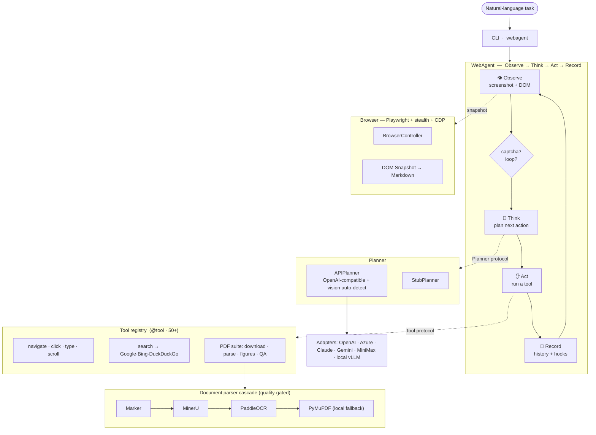
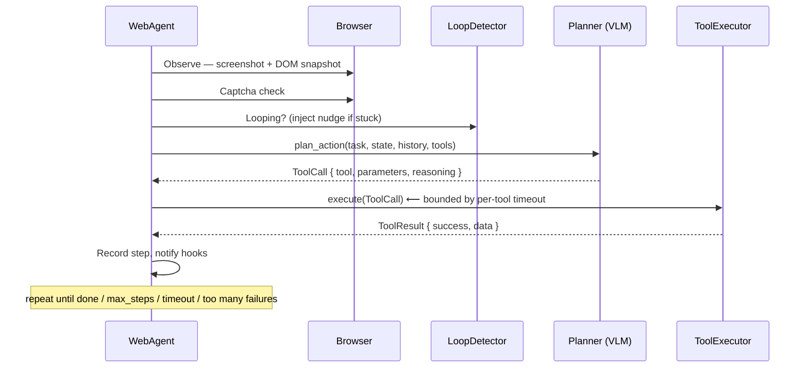
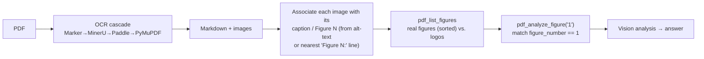

<div align="center">

# 🌐 webagent

**An autonomous, vision-language web agent that turns a natural-language instruction into a sequence of real browser actions — search, navigate, read PDFs, interpret figures, and report.**

[](LICENSE)
[](pyproject.toml)
[](tests/)
[](https://github.com/astral-sh/ruff)
[](https://mypy-lang.org/)

**English** · [简体中文](README.zh-CN.md)

</div>

---

## What is this?

`webagent` is a research-grade autonomous agent that drives a real Chromium browser to accomplish open-ended web tasks described in plain language — e.g. *"Find the most recent Qwen technical report and interpret Figure 1."* It fuses a **Vision-Language Model** (the screenshot it sees) with a **structured DOM snapshot** (the page it reads) to decide, step by step, which browser action to take next.

It is **model-agnostic** (any OpenAI-compatible endpoint, with automatic vision detection and adapters for OpenAI / Azure / Claude / Gemini / MiniMax, plus a local vLLM path) and ships a **document-intelligence pipeline** that parses PDFs through a cloud-OCR cascade, resolves *"Figure N"* by its real caption, and analyzes the figure with vision.

> A natural-language task in → a browser driven autonomously → a cited answer, the analyzed figure, and the extracted content out.

---

## ✨ Highlights

| Area | What makes it interesting |
|------|---------------------------|
| **Agentic core** | A clean **Observe → Think → Act → Record** loop built on `typing.Protocol` interfaces (`Planner`, `Tool`, `AgentHook`) — components are structurally typed and hot-swappable, no inheritance required. |
| **Multimodal planning** | Each step sends a JPEG-compressed screenshot **and** an ad-filtered DOM-to-Markdown snapshot. The planner **auto-probes** the endpoint for real vision support and silently degrades to text-only when a model can't see. |
| **Structured reasoning** | An optional enhanced mode forces the LLM to emit explicit `thinking / memory / next_goal / tool / parameters / reasoning` JSON, parsed into a typed `EnhancedToolCall`. |
| **Robustness engineering** | Four-signal **loop detection** (action-repeat, page-stagnation, URL-oscillation, no-progress), a **hard wall-clock timeout** that bounds trickling LLM responses, consecutive-failure aborts, and captcha detection. |
| **Resilient web search** | A `search` tool that cascades **Google → Bing → DuckDuckGo**, detects bot-block / zero-result pages, and falls back to direct arXiv candidates. |
| **Document intelligence** | A quality-gated OCR cascade — **Marker → MinerU → PaddleOCR → local PyMuPDF** — that produces structured Markdown, tables, sections, and **caption-aware figures**, so *"Figure 1"* resolves to the real labeled figure, not the first stray logo. |
| **Anti-detection browser** | Playwright Chromium with a stealth profile (randomized UA, CDP-injected anti-fingerprinting) and CDP-based interactive-element extraction. |
| **Engineering quality** | ~13.5k LOC, **50+ built-in tools**, **186 tests**, fully type-checked (`mypy`), `ruff`-linted/formatted. |

---

## 🏗️ Architecture

Everything hangs off three `Protocol`s — `Planner`, `Tool`, `AgentHook` — so the brain (LLM), the hands (tools), and the observers (hooks) are independently replaceable.



### Layout

```
src/webagent/
├── core/        # Protocols, Pydantic models, config (single source of truth)
├── agent/       # The loop, session history, lifecycle hooks, loop detector
├── browser/     # Playwright controller, stealth, CDP snapshot, captcha detector
├── planner/     # Stub & API planners, multi-provider adapters, prompt builders
├── parser/      # Cloud-OCR cascade (Marker/MinerU/Paddle) + local PyMuPDF, quality gate
├── tools/       # @tool registry + built-in tools (browser, search, pdf, file, task…)
├── utils/       # PDF/image helpers, path containment
└── cli.py       # Entry point  →  `webagent`
```

---

## 🔄 How it works — one step of the loop



On completion the agent persists, automatically:

- **`artifacts/output.txt`** — the final LLM analysis (the `done` summary)
- **`artifacts/figure.<ext>`** — the exact figure the agent analyzed
- **`artifacts/pdf/`** — everything the OCR cascade extracted

---

## 📑 Document intelligence: resolving *"Figure 1"* correctly

A recurring failure mode in naïve agents: *"Figure 1"* gets mapped to the **first image extracted** from the PDF — often a logo or cover decoration. webagent instead reads the parsed document and resolves figures **by their real caption / number**.



Logos and decorations are kept in a separate `unlabeled_images` bucket and never masquerade as numbered figures. Each provider in the cascade is tried in order; a **quality gate** rejects empty/degraded output and falls through to the next, with a local PyMuPDF extractor as the last resort so a result is always produced.

---

## 🚀 Quick start

```bash
# 1. Install
pip install -e ".[dev]"
playwright install chromium

# 2. Configure (copy the template, fill in an API key)
cp .env.example .env
#   AGENT_MODEL_API_URL=https://openrouter.ai/api/v1/chat/completions
#   AGENT_MODEL_API_KEY=sk-...
#   AGENT_MARKER_API_KEY=...     # optional, for the OCR cascade

# 3. Run
webagent --task "Find the most recent Qwen technical report and interpret Figure 1" --headless
```

Any OpenAI-compatible endpoint works (DeepSeek, OpenRouter, MiniMax, ZAI/GLM, Azure, …). Vision capability is detected automatically — vision models analyze screenshots and figures; text-only models fall back to DOM + OCR text. You can also point at a **local vLLM** server with `--use-vllm`.

```bash
# Override the model / endpoint per run
webagent --task "…" --model "qwen/qwen3.5-flash" \
  --api-url "$API_URL" --api-key "$API_KEY" --output ./run --headless

# Interactive session
webagent --interactive --headless
```

---

## 🧪 End-to-end walkthrough

**Task:** `Find the most recent Qwen technical report and interpret Figure 1`

| Step | Tool | What happened |
|-----:|------|---------------|
| 1 | `arxiv_search` | Found *Qwen3.5-Omni Technical Report* (most recent) |
| 2 | `click_link` → `download_pdf` | Opened the arXiv page, downloaded the PDF |
| 3 | `pdf_parse` | Cloud OCR cascade → structured Markdown + 6 images |
| 4 | `pdf_analyze_figure("1")` | Resolved **Figure 1** *by caption* (not the cover logo) and analyzed it with vision |
| 5 | `done` | Reported the interpretation |

**Resulting `outputs/run/artifacts/`:**

```
artifacts/
├── qwen3.5-omni-technical-report.pdf   # downloaded source
├── pdf/
│   ├── parsed.md                       # OCR-extracted Markdown
│   └── images/ …                       # extracted figures
├── output.txt                          # the final analysis
└── figure.jpg                          # ← the real Figure 1, byte-identical to the source image
```

---

## ⚙️ Configuration

Configuration is centralized in `core/config.py` (`pydantic-settings`); every key reads from an `AGENT_`-prefixed env var or `.env`.

| Setting | Default | Purpose |
|---------|---------|---------|
| `model_api_url` / `model_api_key` / `model_name` | — | LLM backend (OpenAI-compatible) |
| `api_timeout` | `60` | Per-read HTTP timeout for planner calls |
| `api_hard_timeout` | `300` | Hard wall-clock cap per call — bounds trickling/hung responses |
| `use_vllm` / `vllm_api_url` | `False` | Local vLLM fallback |
| `max_steps` | `100` | Loop iteration limit |
| `task_timeout` | `1200` | Seconds before the task times out |
| `tool_timeout` | `600` | Per-tool wall-clock timeout |
| `use_structured_output` | `False` | Enhanced `EnhancedToolCall` planning mode |
| `stealth_mode` | `True` | Anti-bot-detection browser profile |
| `use_cdp` | `True` | CDP-enhanced element detection |
| `enable_loop_detection` | `True` | Four-signal loop detector |
| `ocr_provider` | `marker` | Soft routing hint for the OCR cascade |
| `output_dir` | `./outputs` | Base output directory |

See [`.env.example`](.env.example) for the full template including the OCR-cascade provider keys.

---

## 🛠️ Development

```bash
ruff check src/ tests/          # lint
ruff format src/ tests/         # format
mypy src/                       # type-check
pytest tests/unit/ -v           # unit tests (no browser)
pytest tests/integration/ -v    # integration tests (real browser)
```

See [CONTRIBUTING.md](CONTRIBUTING.md) to add tools or planners.

---

## 👥 Authorship & provenance

The original agent began as a team project for **STAT7008A — Programming for Data Science** (HKU), where **I served as the team lead**; original repository: **[RanJu1122/Web-Agent](https://github.com/RanJu1122/Web-Agent)**.

**This repository is authored and maintained solely by me, [Li Xiuyin](https://github.com/lixiuyin)** — its entire commit history is mine. My contributions to the original project:

- **Local-vLLM functionality** and the **compatible local / API dual-mode** implementation
- **Image extraction** from documents
- **Function testing & refinement**
- The **parallel implementation route — independently simplifying the [browser-use](https://github.com/browser-use/browser-use) library** (a substantial, standalone effort)
- **Report writing**

> The original repository credits my work as *"Local vLLM function, compatible local/API mode implementation, function testing and improving"* — it does **not** record the parallel implementation route (the independent simplification of `browser-use`), which was a major part of my workload, **though it was presented in the submitted course report**.

The post-course rewrite (this repo) goes further: it replaces the original *local-only* model + OCR stack with a provider-agnostic, cloud-cascade design and adds the four-signal loop detector, hard request timeouts, the Google→Bing→DuckDuckGo search cascade, structured planning, and caption-aware figure resolution.

---

## 🙏 Acknowledgements

Originally developed as the *Local VLLM + Playwright Web Agent* course project for **STAT7008A** at the University of Hong Kong ([original repo](https://github.com/RanJu1122/Web-Agent)).

Built with [Playwright](https://playwright.dev/), [PyMuPDF](https://pymupdf.readthedocs.io/), [Pydantic](https://docs.pydantic.dev/), and the [Marker](https://www.datalab.to/) / [MinerU](https://mineru.net/) / PaddleOCR cloud APIs.

---

## 📄 License

[MIT](LICENSE) © webagent contributors
