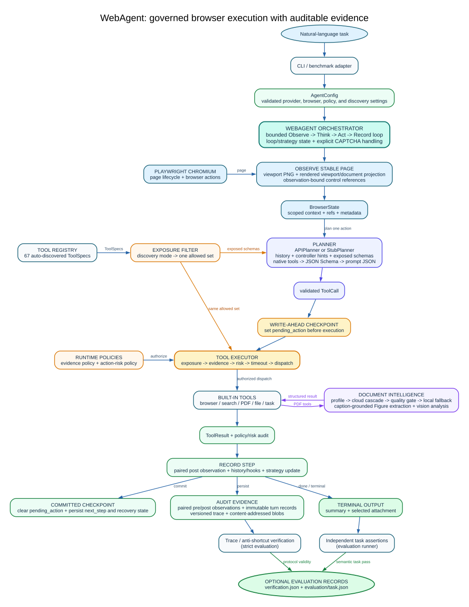
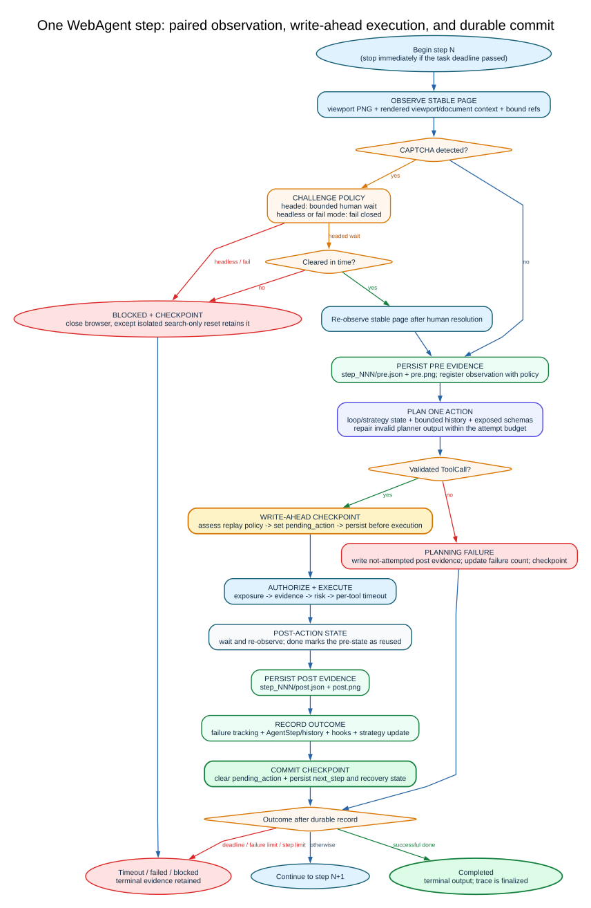
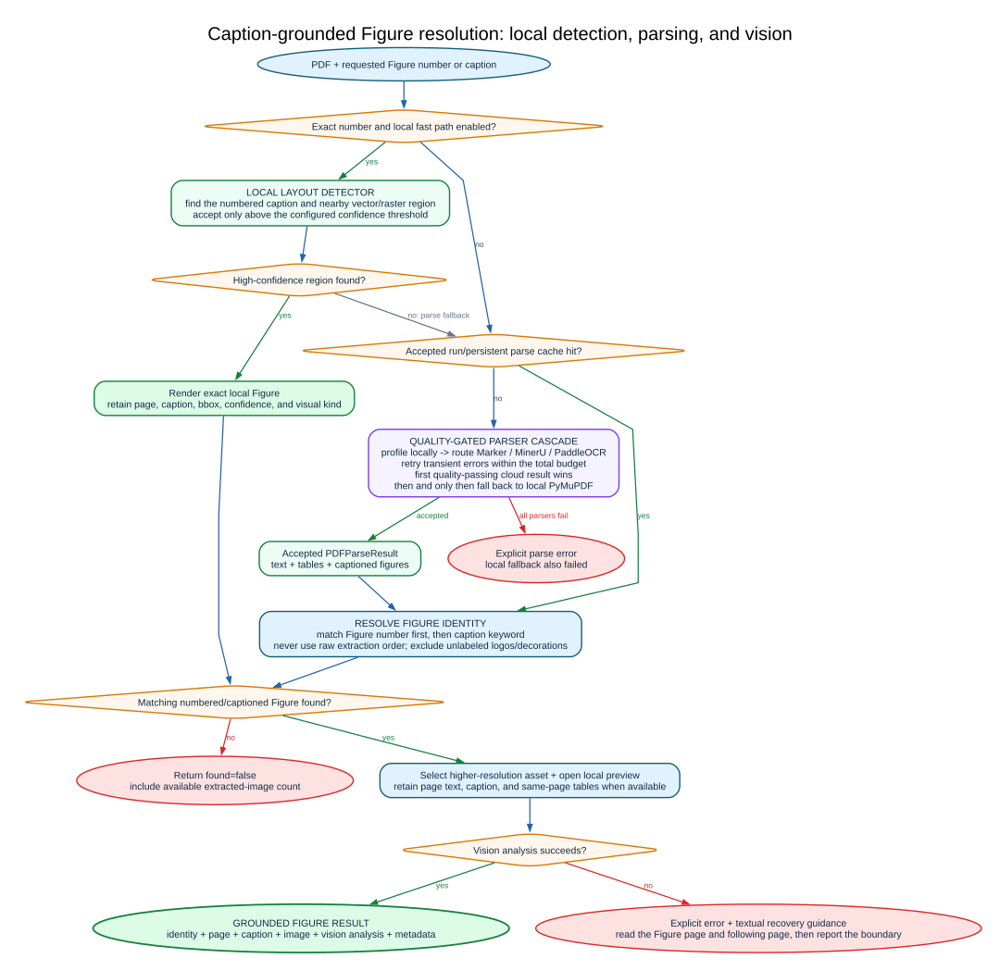

# WebAgent

[](https://github.com/lixiuyin/web-agent/actions/workflows/ci.yml) [](LICENSE) [](pyproject.toml) [](https://github.com/astral-sh/ruff) [](https://mypy-lang.org/)

**English** · [简体中文](README.zh-CN.md)

An autonomous vision-language web agent that turns a natural-language instruction into
real browser actions: search, navigation, PDF reading, figure interpretation, and a
grounded final report.


This animation contains all 17 recorded browser frames from a certificate-valid strict
trajectory, followed by the extracted Figure 1. Every frame lasts two seconds; captions
are grounded in `trace.json`, and failed actions include the recorded error.

## What is WebAgent?

WebAgent drives a real Chromium browser through an **Observe → Think → Act → Record**
loop. It combines a screenshot with a structured DOM snapshot, asks an OpenAI-compatible
planner for one typed tool call, executes it under runtime policy, and retains an
auditable trajectory.

The runtime is model-agnostic, supports local vLLM, and includes document intelligence
for downloading PDFs, routing across OCR/parsing providers, locating a figure by its real
caption, and analyzing the extracted image with vision.

## Highlights

| Area | Capability |
|---|---|
| Agent runtime | Protocol-based planner, tool, and hook interfaces with checkpointed execution |
| Multimodal state | DOM-to-Markdown plus adaptive screenshots and automatic vision probing |
| Structured actions | Native function tools with bounded schema and prompt fallbacks |
| Browser reliability | Stability-aware observations, loop detection, search fallback, and explicit CAPTCHA handling |
| Evidence | Versioned traces, strict anti-shortcut certificates, and independent task judgment |
| Documents | Caption-grounded Figure resolution and quality-gated parser cascade |
| Evaluation | Internal diagnostic suites plus separate BrowserGym WebArena/VWA evidence |
| Engineering | 67 registered tools, strict typing, Ruff, and an 85% branch-coverage gate |

## Architecture

Three structural interfaces—`Planner`, `Tool`, and `AgentHook`—separate model planning,
execution capabilities, and lifecycle observation.



```text
src/webagent/
├── core/        protocols, models, and configuration
├── agent/       loop, history, strategy, hooks, and checkpoints
├── browser/     Playwright controller, snapshots, CDP, and CAPTCHA detection
├── planner/     API/local planners, provider modes, and structured parsing
├── parser/      OCR providers, quality gates, and local PDF recovery
├── tools/       registry, exposure/risk policy, and built-in tools
├── evaluation/  trace verification, metrics, studies, and portfolios
├── schemas/     packaged stable wire schemas
└── utils/       path, image, PDF, logging, and runtime helpers

benchmarks/      executable environments, suites, studies, and manifests
docs/            guides, references, research records, and source study material
outputs/         ignored by default; selected reviewed evidence may be published
```

One step observes stable browser state, builds planner context, selects an allowed tool,
executes it within time/risk bounds, records the result, and atomically updates ordinary
recovery state.



Figure requests are resolved by number and caption rather than by extraction order, so a
logo or cover decoration cannot silently become “Figure 1.”



Editable Graphviz sources and the reproducible renderer are documented in
[`docs/diagrams/`](docs/diagrams/README.md).

## Quick start

```bash
python -m venv .venv
source .venv/bin/activate
pip install -e ".[dev]"
playwright install chromium
cp .env.example .env
```

Set `AGENT_MODEL_API_URL`, `AGENT_MODEL_API_KEY`, and `AGENT_MODEL_NAME` in `.env`, then:

```bash
webagent \
  --task "Find the most recent Qwen technical report and interpret Figure 1" \
  --headless
```

No credentials means `StubPlanner`: the runtime can demonstrate lifecycle behavior, but
it cannot autonomously solve an open-ended task.

Common modes:

```bash
# Browser-visible discovery without direct report/GitHub/arXiv tools
webagent --task "..." --discovery-mode browser-grounded --headless

# Isolated browser-search execution with a verification certificate
webagent --task "..." --strict-eval --headless

# Local OpenAI-compatible vLLM server
webagent --task "..." --use-vllm --headless
```

Use the [getting-started guide](docs/guides/getting-started.md) for resume, verification,
interactive mode, and output inspection. Discovery contracts are documented separately in
[discovery modes](docs/guides/discovery-modes.md).

## Recorded effect showcase

The retained 2026-09-02 case study uses the same Qwen-report task and model across four
runs. It compares ordinary API-augmented discovery with browser-only execution.

| Mode | Terminal state | Actions | Animation |
|---|---|---:|---|
| Hybrid | Completed | 5 | [View](outputs/runs/qwen-report-figure1-20260902/hybrid/trajectory-demo.gif) |
| Browser-grounded | Interrupted | 11 | [View](outputs/runs/qwen-report-figure1-20260902/browser-grounded/trajectory-demo.gif) |
| Browser-grounded retry | Interrupted | 21 | [View](outputs/runs/qwen-report-figure1-20260902/browser-grounded-r2/trajectory-demo.gif) |
| Strict | Completed; certificate valid | 17 | [View](outputs/runs/qwen-report-figure1-20260902/strict/trajectory-demo.gif) |

The two `success=false` runs executed useful browser actions but never reached PDF
download, Figure analysis, and successful `done`. The strict run converted missing
identity/scope evidence into explicit next actions, rejected HTML pretending to be a PDF,
exposed the raw download through `inspect_download_links`, and completed.


The [trace-grounded case study](docs/research/results/qwen-report-modes-2026-09-02.md)
documents planner attempts, search fallbacks, challenge events, failed actions, and the
interpretation boundary. The complete Git/LFS evidence bundle is under
[`outputs/runs/qwen-report-figure1-20260902/`](outputs/runs/qwen-report-figure1-20260902/).

## Evaluation status

| Layer | Scope | Current state |
|---|---|---|
| Repository diagnostics | Public web, controlled sandbox, and forced-resume long horizon | One complete common date; longitudinal evidence remains interim |
| WebArena-Verified Hard | BrowserGym native tasks/evaluator | Not run; official sites and reset calibration required |
| VisualWebArena | BrowserGym native tasks/evaluator | Not run; official sites, reset calibration, and evaluator assets required |

Scores are never averaged across these layers. Read exact dated results in the
[results index](docs/research/results/README.md), the stable methodology in the
[evaluation protocol](docs/research/evaluation-protocol.md), and executable suites in the
[benchmark guide](benchmarks/README.md).

## Documentation

| Goal | Entry point |
|---|---|
| Install and run the agent | [Getting started](docs/guides/getting-started.md) |
| Choose Hybrid, browser-grounded, or strict mode | [Discovery modes](docs/guides/discovery-modes.md) |
| Diagnose provider/browser/runtime failures | [Troubleshooting](docs/guides/troubleshooting.md) |
| Configure the runtime | [Configuration reference](docs/reference/configuration.md) |
| Understand outputs and resume state | [Run artifacts](docs/reference/run-artifacts.md) |
| Review browser and action boundaries | [Browser and security](docs/reference/browser-and-security.md) |
| Run evaluation suites | [Benchmarks](benchmarks/README.md) |
| Study source call chains in Chinese | [中文源码理解手册](docs/understanding-zh/README.md) |
| Navigate everything | [Documentation index](docs/README.md) |

## Development

```bash
ruff check src/ benchmarks/ scripts/ tests/
ruff format --check src/ benchmarks/ scripts/ tests/
mypy src/ benchmarks/ scripts/
pytest tests/unit/ -v
pytest tests/integration/ -v --no-cov
python scripts/check_docs.py
```

See [CONTRIBUTING.md](CONTRIBUTING.md) for tools, planners, style, and pull requests, and
the [release guide](docs/operations/release.md) for reproducible packaging.

## Authorship and provenance

The original agent began as a STAT7008A course team project at HKU, where
[Li Xiuyin](https://github.com/lixiuyin) served as team lead. The original repository is
[RanJu1122/Web-Agent](https://github.com/RanJu1122/Web-Agent). This repository is Li
Xiuyin's independently maintained post-course rewrite and retains a detailed contribution
history in Git and the [changelog](CHANGELOG.md).

## Acknowledgements

Built with [Playwright](https://playwright.dev/), [PyMuPDF](https://pymupdf.readthedocs.io/),
[Pydantic](https://docs.pydantic.dev/), and Marker/MinerU/PaddleOCR-compatible document
services.

## License

[MIT](LICENSE) © WebAgent contributors
