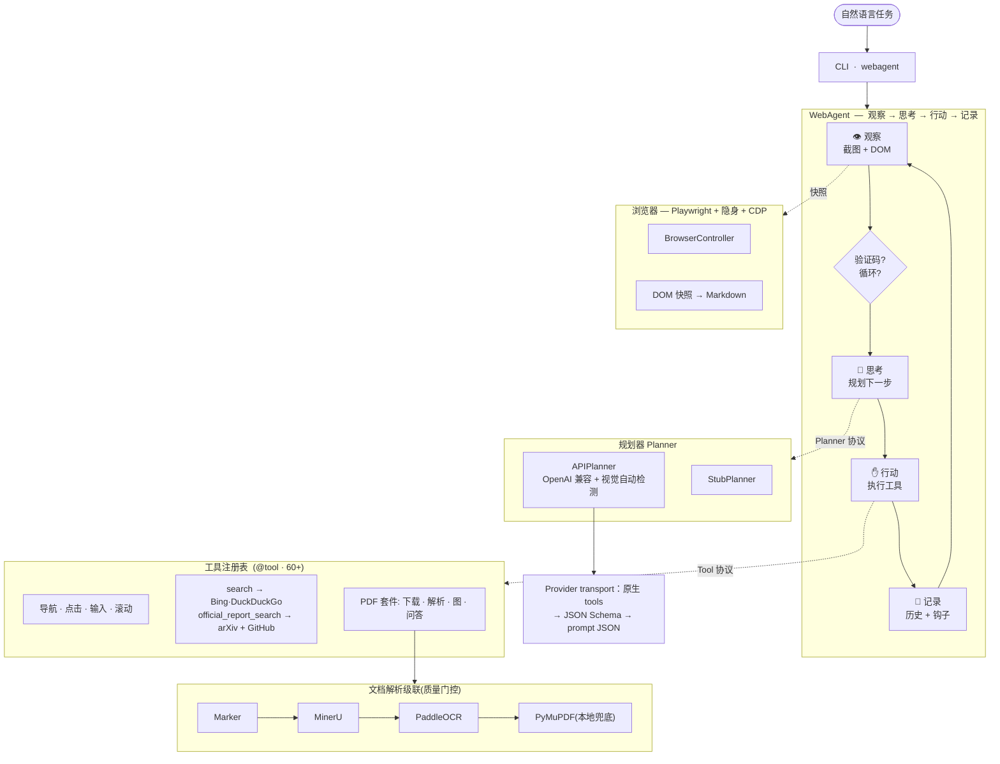
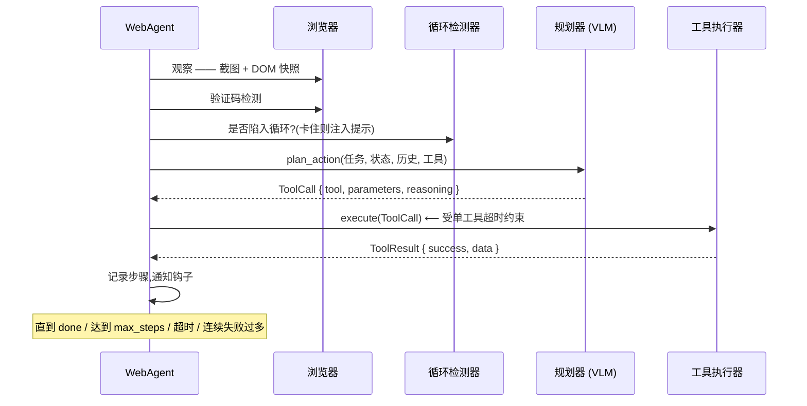
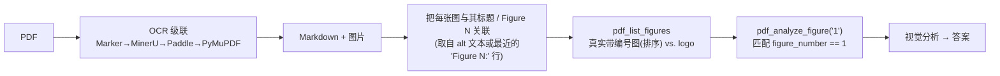

<div align="center">

# 🌐 webagent

**一个自主的「视觉-语言」网页智能体:把一句自然语言指令,转化为一连串真实的浏览器操作 —— 搜索、导航、读取 PDF、解读图表,并给出结论。**

[](LICENSE)
[](pyproject.toml)
[](tests/)
[](https://github.com/astral-sh/ruff)
[](https://mypy-lang.org/)

[English](README.md) · **简体中文**

</div>

---

## 这是什么?

`webagent` 是一个研究级的自主智能体,它驱动真实的 Chromium 浏览器去完成用自然语言描述的开放式网页任务 —— 例如:*「找到最新的 Qwen 技术报告,并解读其中的 Figure 1。」* 它将**视觉-语言模型**(它「看到」的截图)与**结构化 DOM 快照**(它「读到」的页面)融合在一起,逐步决定下一个浏览器动作。

它可连接任意 **OpenAI-compatible** 端点，自动检测视觉能力，并保留本地 vLLM 路径；同时内置一条**文档智能流水线**：通过云端 OCR 级联解析 PDF，按真实标题把*「Figure N」*定位到正确的图，再用视觉模型解读它。

> 输入一句自然语言任务 → 自主驱动浏览器 → 输出带依据的答案、被解读的图、以及抽取出的内容。

---

## ✨ 技术亮点

| 维度 | 亮点 |
|------|------|
| **智能体内核** | 清晰的 **Observe → Think → Act → Record(观察→思考→行动→记录)** 循环,基于 `typing.Protocol` 接口(`Planner`、`Tool`、`AgentHook`)—— 组件采用结构化类型,可热插拔,无需继承。 |
| **多模态规划** | 每一步同时发送 JPEG 压缩后的截图**和**经过去广告处理的 DOM→Markdown 快照。规划器会**主动探测**端点是否真正支持视觉,不支持时静默降级为纯文本模式。 |
| **结构化动作** | 默认优先 provider 原生 function tools；`auto` 只在明确的能力错误下依次降级到 provider JSON Schema、prompt JSON，60+ 个可见工具均有机器可读参数 schema。 |
| **健壮性工程** | 五信号**循环检测**、有界策略切换/重规划、原子可恢复 checkpoint、请求/工具/任务三层超时、畸形响应有限重试、连续失败熔断，以及逐次 token/finish 元数据。 |
| **抗波动的网页搜索** | 浏览器搜索默认使用 **Bing → Yahoo → DuckDuckGo**，逐引擎记录验证码/封锁、selector 漂移、空结果与导航失败，解包 Yahoo tracking URL，并在不编造结果的前提下级联；`official_report_search` 是明确标注的非严格快路径。 |
| **文档智能** | caption 几何约束的本地矢量/栅格 Figure 快路径（歧义时保守回退云解析），以及质量门控 OCR 级联和可选内容寻址缓存。 |
| **隔离浏览器/评测** | 登录任务可继续用持久 profile；临时 profile 与 `--strict-eval` 会隔离旧会话和 PDF 缓存，并为每次运行产出可审计的 `trajectory/trace.json`。 |
| **证据约束 benchmark** | 30 项带日期的公开网页任务包含真实搜索发现；双源 loopback 套件覆盖复杂 SPA、登录态、跨站表单、下载上传交接和沙箱结账；纵向门禁要求 2–3 个模型在三个真实共同日期完成。 |
| **工程质量** | **60+ 内置工具**，分支覆盖率门槛 **85%**，严格 `mypy` 类型检查和 `ruff` 静态检查/格式化。 |

---

## 🏗️ 架构

一切都围绕三个 `Protocol` 展开 —— `Planner`、`Tool`、`AgentHook` —— 因此「大脑」(LLM)、「双手」(工具)、「观察者」(钩子)都可以独立替换。



### 仓库结构

```
src/webagent/
├── core/        # 协议、Pydantic 模型、配置(单一事实来源)
├── agent/       # 主循环、会话历史、生命周期钩子、循环检测器
├── browser/     # Playwright 控制器、隐身、CDP 快照、验证码检测
├── planner/     # Stub & API 规划器、多厂商适配器、提示词构造
├── parser/      # 云端 OCR 级联(Marker/MinerU/Paddle)+ 本地 PyMuPDF、质量门控
├── tools/       # @tool 注册表 + 内置工具(浏览器、搜索、PDF、文件、任务……)
├── evaluation/  # 网页终态断言、benchmark 运行器与聚合指标
├── utils/       # PDF/图像辅助、路径越界防护
└── cli.py       # 入口  →  `webagent`

benchmarks/
├── core/                         # benchmark 共用布局与辅助函数
├── environments/controlled_web/  # 可复现的本地网页环境
├── suites/                        # 开放网页、受控网页与文档套件
└── studies/                       # 重复、多模型、纵向研究

docs/research/     # 实验生命周期、证据规则与失败 taxonomy
outputs/           # 已忽略的工作区：runs/、studies/、legacy/
```

---

## 🔄 循环的一步是怎样的



未传 `--output` 时，CLI 会在
`outputs/runs/<UTC 日期>/<模型>/<任务>-<run-id>/` 下分配唯一运行目录；显式传入
`--output` 时，该路径就是单次运行根目录。一次运行把声明、证据、控制状态与外部判分分开：

```text
<run>/
├── manifest.json
├── trajectory/
│   ├── trace.json
│   ├── verification.json          # 仅严格评测
│   └── turns/turn-NNN.json        # 普通会话每轮的不可变快照
├── observations/screenshots/
├── control/checkpoints/
│   ├── latest.json
│   └── latest.json.bak
├── artifacts/
│   ├── downloads/                 # 下载的 PDF 与其他文件
│   ├── documents/<doc-id>/        # 内容寻址的解析产物
│   ├── figures/
│   └── files/
├── result/
│   ├── summary.txt
│   ├── attachments/
│   └── turns/turn-NNN/
│       ├── summary.txt
│       └── attachments/
└── evaluation/
```

`trajectory/` 是可审计执行证据，`control/` 是可恢复控制状态，`artifacts/` 是任务中
获取或派生的文件，`result/` 是智能体声明，`evaluation/` 是独立判分。完整契约见
[研究工作流](docs/research/README.md)。
普通 interactive session 复用同一个 owned run：canonical trace/result 表示最新一轮，
`trajectory/turns/` 与 `result/turns/` 按单调编号保留每轮不可变快照，step 编号也连续递增。
strict/search-only 评测禁止多轮 run。

---

## 📑 文档智能:正确地定位*「Figure 1」*

朴素智能体常见的失败模式:把*「Figure 1」*映射成 PDF 中**抽取出的第一张图** —— 往往是 logo 或封面装饰。webagent 的做法是读取解析后的文档,按**真实标题/编号**来定位图。



logo 与装饰图会被单独放进 `unlabeled_images`,绝不会被冒充为带编号的图。级联中每个 provider 依次尝试;**质量门控**会拒绝空/劣质输出并落到下一个,最后以本地 PyMuPDF 兜底,保证总有结果产出。

---

## 🚀 快速开始

```bash
# 1. 安装
pip install -e ".[dev]"
playwright install chromium

# 2. 配置(复制模板,填入 API Key)
cp .env.example .env
#   AGENT_MODEL_API_URL=https://openrouter.ai/api/v1/chat/completions
#   AGENT_MODEL_API_KEY=sk-...
#   AGENT_MARKER_API_KEY=...     # 可选,用于 OCR 级联

# 3. 运行
webagent --task "找到最新的 Qwen 技术报告并解读 Figure 1" --headless
```

可安装的 distribution 名为 `lixiuyin-webagent`；Python import 包名和命令行入口仍为
`webagent`。正式版本发布前，开发环境使用上面的源码 editable 安装方式。

任意 OpenAI 兼容端点皆可(DeepSeek、OpenRouter、MiniMax、ZAI/GLM、Azure……)。视觉能力会被自动检测 —— 视觉模型会分析截图和图表,纯文本模型则回退到 DOM + OCR 文本。也可通过 `--use-vllm` 指向**本地 vLLM** 服务。

```bash
# 按次覆盖模型 / 端点
webagent --task "…" --model "qwen/qwen3.5-flash" \
  --api-url "$API_URL" --api-key "$API_KEY" --output ./run --headless

# 交互式会话
webagent --interactive --headless

# 可审计基准：新 profile/输出、仅搜索引擎发现、禁用跨运行 PDF 缓存
webagent --task "…" --strict-eval --headless

# 等价的浏览器搜索基准写法
webagent --task "…" --search-engine-only --headed

# 排查 provider 兼容性时可固定一种 planner transport
webagent --task "…" --planner-output-mode native-tools --headless

# 从普通模式的中断点继续；重复 task 以校验其 hash
webagent --task "…" \
  --resume outputs/runs/2026-08-30/model/task-runid/control/checkpoints/latest.json

# headed 模式遇到验证码时等待用户手动清除；系统不会自动破解
webagent --task "…" --strict-eval --headed \
  --captcha-handling wait_for_human --captcha-wait-timeout 180

# 校验一次运行是否满足无捷径 contract
python -m webagent.evaluation.trace_verifier \
  outputs/runs/2026-08-30/model/task-runid/trajectory/trace.json
```

`--strict-eval` 与 `--search-engine-only` 现在执行同一套无捷径发现约束，不再存在
“strict 但仍可调用 GitHub/arXiv API”的空档。它们使用临时 profile 和独立输出，关闭
持久 PDF cache，强制首个成功动作是浏览器 `search`，并隐藏、拒绝专用发现工具。
`goto`/`download_pdf` 的 URL 必须出现在 planner 实际收到的结果 JSON 中，或是 planner
刚观察到的当前页 URL；未暴露的整页 DOM anchor 不能成为授权证据。

对于“最新”任务，策略要求两个不同的有效搜索、一个含当前年份且不限论文索引的宽搜索，
以及一个“主题 + 当前年份 + model/version/release/series/lineup”的发布谱系广搜；两者都不能
预先锁定某个候选，而且搜索结果本身必须包含与主题相关的版本/发布证据，不能只在 query 中
堆砌策略关键词。SERP 中只要出现更高的点分主题版本，即使来源是第三方，也必须先完成该
精确版本的有效回搜才能下载或结束。官方身份搜索之后还必须进行独立 owner 范围搜索：可用
`site:github.com/QwenLM`，也可在搜索引擎拒绝 path scope 时使用 `GitHub QwenLM …`，但结果
query 文本必须同时包含字面当前年份（如 `2026`）和候选名，不能只设置 `recency=year`；结果
必须属于先前背书的同一 owner，并覆盖最终选中的候选仓库/host；裸 `site:github.com` 不足以解锁。独立身份搜索背书 owner 后，
范围搜索可使用带版本的主题名，但仍必须包含当前年份并返回同 owner 结果。该链条是独立搜索证据绑定，
不是法律意义的域名所有权证明。
若最终候选位于代码仓库，前置的非 site 官方身份搜索必须实际返回该仓库 host 与 owner；只找到
厂商主页，不能自动背书之后出现的 GitHub owner。

普通 browser-grounded 与 strict planner 都会在首次下载前看到完整证据清单；若仍提前尝试，
拒绝结果会一次返回全部未满足项及结构化 `missing_prerequisites`，避免逐次试错。
每次有效搜索之后，history 还会向 planner 显示剩余清单或“已完成”状态；被策略拒绝的
`done` 始终是失败步骤，不能再把整次运行误标为 completed。

下载内容必须带 PDF 文件头。HTML 预览会被删除，`download_pdf` 不再解析失败响应并偷偷
返回 raw URL；planner 必须先打开预览页并显式调用 `inspect_download_links`。该步骤也会公开
页面可见的 datetime 元数据与文件 History 链接，用于核验精确日期。严格运行会
同时写 `trajectory/trace.json` 与 SHA-256 绑定的 `trajectory/verification.json`；只有后者的 `valid=true` 才表示
单次连续运行满足反捷径 contract。未解决的验证码事件会使 certificate 无效。轨迹采用
随包发布的 v8 JSON Schema，并记录 producer 版本与源码哈希；旧 v7 轨迹会先
确定性迁移，未知版本则 fail closed。恢复/检查点元数据是显式字段，恢复后的运行不能被
认证为单次连续 strict-eval 轨迹。严格无头运行默认 fail closed，headed 模式只有显式选择
时才等待人工清除，任何模式都不会破解或
绕过验证码。certificate 仍不代表自然语言解读本身一定正确。

普通运行会在每步之后、以及可能产生歧义的动作执行之前，原子写入带 checksum 的
`control/checkpoints/latest.json`。Checkpoint 只保存 task 的 SHA-256；恢复时必须再次提供
`--task` 并校验 hash，同时校验影响行为的 config、源码 fingerprint、policy/loop/tab 状态
和已引用 artifact 的 hash。自由页面文本、模型理由、表单输入、URL query/凭证、绝对本地
路径、cookie 和 local storage 都不会写入。未决的点击、表单、上传或其他潜在状态修改绝不会
被静默重放；可信登录态若需跨进程延续，应显式使用 persistent profile。completed/blocked
不允许恢复；strict/search-engine-only 评测要求单次连续轨迹，因此完全禁用 checkpoint。

带日期的 open-web runner 启动前会要求输出卷至少有 512 MiB 空间，并把临时 Chromium
profile 放在该输出目录下；因此可把 `--output` 指向大容量/外接卷，同时隔离运行时 profile。

---

## 🧪 端到端演示

下面是需要显式 `--discovery-mode hybrid` 的可选工具增强快路径；由于第一步调用结构化来源
API，它**不是**搜索引擎 benchmark。默认普通模式仍是 browser-grounded，使用
`--search-engine-only` 可进一步评测带证书的严格浏览器搜索流程。

**任务:** `找到最新的 Qwen 技术报告并解读 Figure 1`

| 步骤 | 工具 | 发生了什么 |
|-----:|------|-----------|
| 1 | `official_report_search` | 比较标题匹配的 arXiv 线索与 GitHub 精确 owner 的报告文件及提交时间 |
| 2 | `download_pdf` | 通过 GitHub raw 直链下载 PDF |
| 3 | `pdf_analyze_figure("1")` | 一次解析后**按标题**定位 Figure 1（而非封面 logo），并用视觉模型分析 |
| 4 | `done` | 给出解读结论 |

**分配到的 run 根目录中的相关文件：**

```text
trajectory/
└── trace.json                                      # 规划/工具/证据轨迹
artifacts/
├── downloads/latest-first-party-technical-report.pdf
└── documents/latest-first-party-technical-report-<content-sha>/
    ├── parsed.md                                   # OCR 抽取的 Markdown
    ├── parsed_content_list.json                    # provider 提供时存在
    └── figures/                                    # 本地/解析器 Figure 裁剪
result/
├── summary.txt                                     # 最终分析
└── attachments/figure.jpg                          # 选中的 Figure 1
```

---

## ⚙️ 配置

配置集中在 `core/config.py`(`pydantic-settings`);每个键都可由 `AGENT_` 前缀的环境变量或 `.env` 提供。

| 配置项 | 默认值 | 用途 |
|--------|--------|------|
| `model_api_url` / `model_api_key` / `model_name` | — | LLM 后端(OpenAI 兼容) |
| `api_timeout` | `60` | 规划器调用的单次读超时 |
| `api_hard_timeout` | `300` | 单次调用的硬性墙钟上限 —— 约束细水长流/挂死的响应 |
| `planner_max_tokens` / `vision_max_tokens` | `4096` / `2000` | 工具规划与详细图像分析使用独立输出预算 |
| `history_context_length` / `history_full_result_steps` | `10` / `2` | 保留十步动作，但只重放最近两步完整工具结果；更早证据压缩为摘要 |
| `planner_reasoning_effort` | — | 兼容提供商的可选 `none`–`max` planner 推理预算；默认不发送 |
| `vision_brief_max_tokens` / `vision_max_words` | `1200` / `350` | 限制探测/简短视觉输出，并要求精练证据 |
| `planner_max_attempts` | `2` | 每个逻辑步骤对空/畸形规划输出的修复尝试数 |
| `checkpoint_enabled` / `checkpoint_filename` | `True` / `latest.json` | `control/checkpoints/` 下的原子、非敏感控制器恢复状态 |
| `strategy_enabled` | `True` | 根据 planner 失败、policy 拒绝、循环和连续无进展切换策略并重规划 |
| `use_vllm` / `vllm_api_url` | `False` | 本地 vLLM 回退 |
| `max_steps` | `100` | 循环迭代上限 |
| `task_timeout` | `1200` | 任务超时(秒) |
| `tool_timeout` | `600` | 单工具墙钟超时 |
| `planner_output_mode` | `auto` | 优先 provider 原生 tools；也可显式选择 `json-schema` 或 `prompt-json` |
| `stealth_mode` | `False` | 显式兼容选项；严格评测始终关闭 |
| `browser_slow_mo_ms` / `browser_humanize_delays` | `0` / `False` | 固定操作延迟；随机拟人等待仅显式兼容时开启 |
| `browser_locale` / `browser_timezone_id` | — / — | 默认保留浏览器/系统原生值，仅在任务明确需要时覆盖 |
| `browser_ignore_https_errors` | `False` | 默认验证 TLS；不安全的证书绕过必须显式开启 |
| `allow_google_search` | `False` | 是否启用 Google 自动搜索；默认避免人机认证 |
| `captcha_handling` | `report` | headed 下报告并等待人工清除，超时或 headless 均阻断并关闭浏览器；strict 立即失败，任何模式都不绕过验证码 |
| `captcha_wait_timeout_seconds` | `180` | headed 模式等待人工清除验证码的最长秒数 |
| `github_token` | — | 可选，提高官方报告检索所用 GitHub API 配额 |
| `official_report_source_timeout_seconds` | `15` | 分别限制 arXiv/GitHub，避免慢源拖住已有可用证据 |
| `discovery_mode` | `browser-grounded` | 默认隐藏直连来源 API；仅显式选择 `hybrid` 才启用 API 增强检索 |
| `high_risk_action_policy` | `deny` | 默认拒绝外部高影响动作；`prompt` 终端确认，`allow` 显式放行 |
| `browser_profile_mode` | `temporary` | 默认每进程隔离；持久会话状态必须显式开启 |
| `browser_stale_profile_max_age_seconds` | `3600` | 仅回收超过阈值、带 WebAgent 标记且 owner PID 已消失的临时 profile |
| `browser_upload_root` | `./uploads` | 限制获批的文件上传只能读取该目录 |
| `persistent_pdf_cache` | `False` | 跨运行 PDF 解析缓存必须显式开启 |
| `strict_eval_mode` | `False` | 强制临时 profile，并禁用持久 PDF 缓存 |
| `search_engine_only` | `False` | 强制浏览器搜索，拒绝直接来源工具与未观察 URL |
| `use_cdp` | `True` | CDP 增强的元素检测 |
| `enable_loop_detection` | `True` | 包含滚动抖动在内的五信号循环检测器 |
| `ocr_provider` | `marker` | OCR 级联的软路由提示 |
| `local_figure_fast_path` | `True` | 对无歧义的精确编号 Figure 优先本地渲染 |
| `local_figure_min_confidence` / `local_figure_render_dpi` | `0.9` / `144` | 安全绕过阈值与裁剪分辨率 |
| `output_dir` | `./outputs` | 未传 `--output` 时是 CLI 工作区根；显式 `--output` 是一个准确的 run 根目录 |

完整模板(含 OCR 级联各 provider 的密钥)见 [`.env.example`](.env.example)。

---

## 🔬 研究工作流

仓库围绕三条相互连接的研究主线组织：

- **长程评测与失败分析**：保留可验证轨迹，定位失败出现/恢复位置，统计反复出现的可观察模式，
  并检验干预是否迁移到 held-out task 与 held-out setting。
- **Agent 系统与评测 harness**：研究规划、memory/context、工具暴露、检索证据、不完美反馈和执行
  控制如何交互；evaluator 独立检查终态与证据，不以 Agent 的 `done` 声明代替成功。
- **可控环境与交互数据**：用确定性站点和定向故障场景获得可复现证据，再用带日期的开放网页套件
  检查外部有效性，而不把任何单一环境当作普遍代表。

失败报告区分直接 `observed` 事件、自动规则给出的 `candidate` 子系统归因，以及人工/受控对照支持的
`adjudicated` 结论。校准报告先给 confidence coverage，缺失的 task-success probability 不会被静默
补值；transfer 报告分开 development、held-out task 与 held-out setting，缺少必要 split 或出现
leakage 时明确 unavailable。实验生命周期见 [docs/research/](docs/research/README.md)，可执行套件见
[benchmarks/README.md](benchmarks/README.md)。

---

## 🛠️ 开发

```bash
ruff check src/ benchmarks/ tests/          # 静态检查
ruff format src/ benchmarks/ tests/         # 格式化
mypy src/ benchmarks/                       # 类型检查
pytest tests/unit/ -v           # 单元测试(无需浏览器)
pytest tests/integration/ -v --no-cov  # 集成测试(真实浏览器)
python -m benchmarks.suites.document_figures.fast_path
python -m benchmarks.suites.controlled_web.general \
  --mode scripted-harness-baseline --tool-set browser-only
python -m benchmarks.suites.open_web.parallel \
  --manifest benchmarks/manifests/open_web_general.json \
  --model z-ai/glm-5.3-flash --shards 3
```

新的 canonical module 位于 `benchmarks.suites.*` 与 `benchmarks.studies.*`；旧的扁平模块名
仅保留一个发布周期的薄兼容 wrapper。`scripted-harness-baseline` 只校准测试站、浏览器动作、
轨迹和判分器，并不代表模型能力。配置 API 或
本地 vLLM 后使用 `--mode agent` 才会得到真实智能体成绩；成功依据浏览器与服务端
终态以及显式答案事实/引用，而不是模型自己声称完成。开放网页 runner 使用临时 profile、
来源 URL 和有效期，并把每次摘要追加到 `ledger/time-slices.jsonl`；一次通过不等于通用成功率。指标和消融参数见
[benchmarks/README.md](benchmarks/README.md)。

未传 benchmark `--output` 时会分配不可覆盖的 execution：
`outputs/studies/<suite>/executions/<UTC-date>/<model>/<condition>/<execution-id>/`；单项任务位于
该 execution 的 `runs/<task-id>/`。显式 `--output` 则准确指定一个 execution 根目录。
若其中已有 results 或 run evidence，runner 会拒绝覆盖。
单次套件使用 `benchmarks.suites.*`，重复/多模型/日期矩阵使用 `benchmarks.studies.*`。
execution 内把声明/生成的 `inputs/`、任务 `runs/`、append-only `ledger/time-slices.jsonl`、保留证据
`evidence/`、派生产物 `artifacts/`、聚合 `analysis/` 与完整 `results.json` 分区保存。

历史顶层输出可以在不重写文件内容的情况下清点并迁移：

```bash
python -m webagent.evaluation.migration outputs --label pre-workspace-v1
python -m webagent.evaluation.migration outputs --label pre-workspace-v1 --apply
```

第一条命令只做 dry run；第二条按大小与 SHA-256 校验后，把完整旧目录移动到
`outputs/legacy/pre-workspace-v1/tree/`，并写 `migration-manifest.json`。迁移器不会补造缺失的
研究元数据。

普通运行默认使用临时 profile 和 browser-grounded URL 来源校验；既没有用户 URL、也没有已加载
HTTP(S) 页面时，发现任务必须先经过浏览器搜索，“最新”网页发现还必须满足独立的时效性与官方来源证据门。执行器层拒绝
未经批准的上传、购买、发布、删除等高风险动作；这不是只写在提示词里的约定。浏览器能力覆盖标签页、
iframe、开放 Shadow DOM、受限上传与下载捕获。成熟度结论应基于重复真实模型矩阵和至少
三个不同日期的 30 题/10 域开放网页切片，而不是单条成功轨迹。

面向长时程研究，项目现已包含 60 阶段受控工作流、在全新临时浏览器会话中的
checkpoint 恢复、受限且可审计的持久控制器记忆、轨迹崩溃/恢复指标，以及默认
fail-closed 的跨套件实证 portfolio。只有当每个模型/日期单元同时覆盖 30 项开放
网页任务、SPA、登录、跨站表单、文件、沙箱交易和 50+ 动作轨迹，并在至少三个
真实日期上对 2–3 个模型形成完整公共日期后，portfolio 才会标记为 ready；具备
采集器本身不等于已经完成这些实证运行。

如何新增工具或规划器见 [CONTRIBUTING.md](CONTRIBUTING.md)。

---

## 👥 作者与项目沿革

原始智能体最初是香港大学 **STAT7008A —— Programming for Data Science** 的小组作业,**我担任组长(队长)**;原始仓库:**[RanJu1122/Web-Agent](https://github.com/RanJu1122/Web-Agent)**。

**本仓库由我([Li Xiuyin](https://github.com/lixiuyin))独立编写与维护** —— 全部提交历史均出自我手。我在原始项目中的贡献:

- **本地 vLLM 功能**,以及**本地 / API 双模式兼容**实现
- 文档**图像抽取**
- **功能测试与打磨**
- **并行实现路线 —— 独立完成对 [browser-use](https://github.com/browser-use/browser-use) 库的简化**(一项独立且工作量巨大的工作)
- **报告撰写**

> 原始仓库将我的贡献记为 *“Local vLLM function, compatible local/API mode implementation, function testing and improving”* —— 但**并未**记录「并行实现路线」(独立简化 `browser-use` 库)这一在我的工作量中占很大比重的工作,尽管该工作**已在提交的课程报告中呈现**。

课程之后的重写(即本仓库)更进一步:将原先「仅本地」的模型 + OCR 方案替换为与厂商无关的云端级联设计,并新增了五信号循环检测、硬性请求超时、Bing→Yahoo→DuckDuckGo 浏览器搜索与结构化 GitHub 检索、结构化规划,以及带标题的图定位。

---

## 🙏 致谢

最初作为香港大学 **STAT7008A** 课程项目《Local VLLM + Playwright Web Agent》开发([原始仓库](https://github.com/RanJu1122/Web-Agent))。

构建于 [Playwright](https://playwright.dev/)、[PyMuPDF](https://pymupdf.readthedocs.io/)、[Pydantic](https://docs.pydantic.dev/),以及 [Marker](https://www.datalab.to/) / [MinerU](https://mineru.net/) / PaddleOCR 云端 API 之上。

---

## 📄 许可证

[MIT](LICENSE) © webagent contributors
