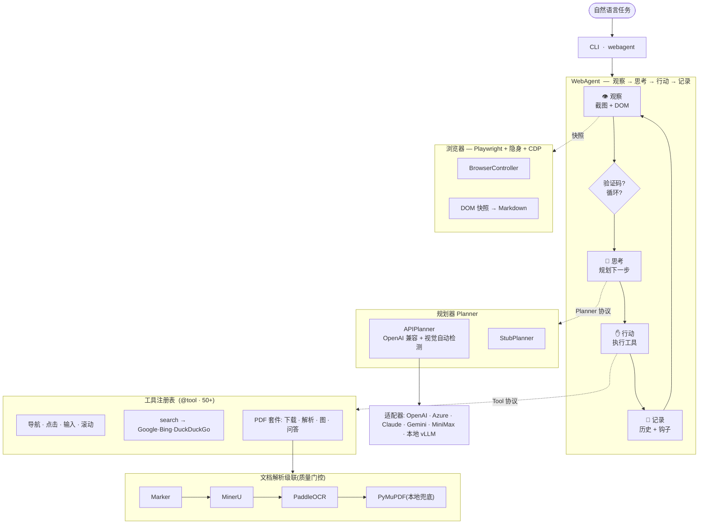
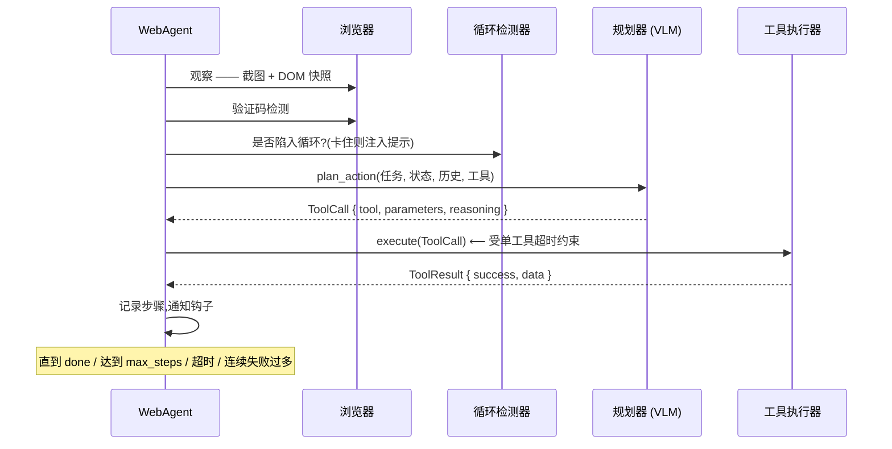
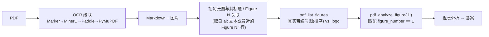

<div align="center">

# 🌐 webagent

**一个自主的「视觉-语言」网页智能体:把一句自然语言指令,转化为一连串真实的浏览器操作 —— 搜索、导航、读取 PDF、解读图表,并给出结论。**

[](LICENSE)
[](pyproject.toml)
[](tests/)
[](https://github.com/astral-sh/ruff)
[](https://mypy-lang.org/)

[English](README.md) · **简体中文**

</div>

---

## 这是什么?

`webagent` 是一个研究级的自主智能体,它驱动真实的 Chromium 浏览器去完成用自然语言描述的开放式网页任务 —— 例如:*「找到最新的 Qwen 技术报告,并解读其中的 Figure 1。」* 它将**视觉-语言模型**(它「看到」的截图)与**结构化 DOM 快照**(它「读到」的页面)融合在一起,逐步决定下一个浏览器动作。

它**与模型无关**(支持任意 OpenAI 兼容端点,自动检测视觉能力,并为 OpenAI / Azure / Claude / Gemini / MiniMax 提供适配器,同时保留本地 vLLM 路径),并内置一条**文档智能流水线**:通过云端 OCR 级联解析 PDF,按真实标题把*「Figure N」*定位到正确的图,再用视觉模型解读它。

> 输入一句自然语言任务 → 自主驱动浏览器 → 输出带依据的答案、被解读的图、以及抽取出的内容。

---

## ✨ 技术亮点

| 维度 | 亮点 |
|------|------|
| **智能体内核** | 清晰的 **Observe → Think → Act → Record(观察→思考→行动→记录)** 循环,基于 `typing.Protocol` 接口(`Planner`、`Tool`、`AgentHook`)—— 组件采用结构化类型,可热插拔,无需继承。 |
| **多模态规划** | 每一步同时发送 JPEG 压缩后的截图**和**经过去广告处理的 DOM→Markdown 快照。规划器会**主动探测**端点是否真正支持视觉,不支持时静默降级为纯文本模式。 |
| **结构化推理** | 可选的增强模式强制 LLM 输出显式的 `thinking / memory / next_goal / tool / parameters / reasoning` JSON,并解析为带类型的 `EnhancedToolCall`。 |
| **健壮性工程** | 四信号**循环检测**(动作重复、页面停滞、URL 振荡、无进展),一个**硬性墙钟超时**用于约束「细水长流」式的 LLM 响应,连续失败熔断,以及验证码检测。 |
| **抗封锁的网页搜索** | `search` 工具按 **Google → Bing → DuckDuckGo** 级联,识别机器人拦截 / 零结果页,并可回退到直接的 arXiv 候选。 |
| **文档智能** | 带质量门控的 OCR 级联 —— **Marker → MinerU → PaddleOCR → 本地 PyMuPDF** —— 产出结构化 Markdown、表格、章节,以及**带标题的图**,使*「Figure 1」*能定位到真正的带编号图,而非第一张杂图/logo。 |
| **反检测浏览器** | Playwright Chromium + 隐身配置(随机 UA、CDP 注入反指纹),并通过 CDP 提取可交互元素。 |
| **工程质量** | 约 1.35 万行代码,**50+ 内置工具**,**186 个测试**,完整类型检查(`mypy`),`ruff` 静态检查/格式化。 |

---

## 🏗️ 架构

一切都围绕三个 `Protocol` 展开 —— `Planner`、`Tool`、`AgentHook` —— 因此「大脑」(LLM)、「双手」(工具)、「观察者」(钩子)都可以独立替换。



### 目录结构

```
src/webagent/
├── core/        # 协议、Pydantic 模型、配置(单一事实来源)
├── agent/       # 主循环、会话历史、生命周期钩子、循环检测器
├── browser/     # Playwright 控制器、隐身、CDP 快照、验证码检测
├── planner/     # Stub & API 规划器、多厂商适配器、提示词构造
├── parser/      # 云端 OCR 级联(Marker/MinerU/Paddle)+ 本地 PyMuPDF、质量门控
├── tools/       # @tool 注册表 + 内置工具(浏览器、搜索、PDF、文件、任务……)
├── utils/       # PDF/图像辅助、路径越界防护
└── cli.py       # 入口  →  `webagent`
```

---

## 🔄 循环的一步是怎样的



任务完成时,智能体会**自动**持久化:

- **`artifacts/output.txt`** —— 大模型最终的分析结果(`done` 摘要)
- **`artifacts/figure.<ext>`** —— 智能体实际解读的那幅图
- **`artifacts/pdf/`** —— OCR 级联抽取出的全部内容

---

## 📑 文档智能:正确地定位*「Figure 1」*

朴素智能体常见的失败模式:把*「Figure 1」*映射成 PDF 中**抽取出的第一张图** —— 往往是 logo 或封面装饰。webagent 的做法是读取解析后的文档,按**真实标题/编号**来定位图。



logo 与装饰图会被单独放进 `unlabeled_images`,绝不会被冒充为带编号的图。级联中每个 provider 依次尝试;**质量门控**会拒绝空/劣质输出并落到下一个,最后以本地 PyMuPDF 兜底,保证总有结果产出。

---

## 🚀 快速开始

```bash
# 1. 安装
pip install -e ".[dev]"
playwright install chromium

# 2. 配置(复制模板,填入 API Key)
cp .env.example .env
#   AGENT_MODEL_API_URL=https://openrouter.ai/api/v1/chat/completions
#   AGENT_MODEL_API_KEY=sk-...
#   AGENT_MARKER_API_KEY=...     # 可选,用于 OCR 级联

# 3. 运行
webagent --task "找到最新的 Qwen 技术报告并解读 Figure 1" --headless
```

任意 OpenAI 兼容端点皆可(DeepSeek、OpenRouter、MiniMax、ZAI/GLM、Azure……)。视觉能力会被自动检测 —— 视觉模型会分析截图和图表,纯文本模型则回退到 DOM + OCR 文本。也可通过 `--use-vllm` 指向**本地 vLLM** 服务。

```bash
# 按次覆盖模型 / 端点
webagent --task "…" --model "qwen/qwen3.5-flash" \
  --api-url "$API_URL" --api-key "$API_KEY" --output ./run --headless

# 交互式会话
webagent --interactive --headless
```

---

## 🧪 端到端演示

**任务:** `找到最新的 Qwen 技术报告并解读 Figure 1`

| 步骤 | 工具 | 发生了什么 |
|-----:|------|-----------|
| 1 | `arxiv_search` | 找到《Qwen3.5-Omni Technical Report》(最新) |
| 2 | `click_link` → `download_pdf` | 打开 arXiv 页面,下载 PDF |
| 3 | `pdf_parse` | 云端 OCR 级联 → 结构化 Markdown + 6 张图 |
| 4 | `pdf_analyze_figure("1")` | **按标题**定位到 Figure 1(而非封面 logo),并用视觉模型分析 |
| 5 | `done` | 给出解读结论 |

**产出的 `outputs/run/artifacts/`:**

```
artifacts/
├── qwen3.5-omni-technical-report.pdf   # 下载的源文件
├── pdf/
│   ├── parsed.md                       # OCR 抽取的 Markdown
│   └── images/ …                       # 抽取出的图
├── output.txt                          # 最终分析结果
└── figure.jpg                          # ← 真正的 Figure 1,与源图逐字节一致
```

---

## ⚙️ 配置

配置集中在 `core/config.py`(`pydantic-settings`);每个键都可由 `AGENT_` 前缀的环境变量或 `.env` 提供。

| 配置项 | 默认值 | 用途 |
|--------|--------|------|
| `model_api_url` / `model_api_key` / `model_name` | — | LLM 后端(OpenAI 兼容) |
| `api_timeout` | `60` | 规划器调用的单次读超时 |
| `api_hard_timeout` | `300` | 单次调用的硬性墙钟上限 —— 约束细水长流/挂死的响应 |
| `use_vllm` / `vllm_api_url` | `False` | 本地 vLLM 回退 |
| `max_steps` | `100` | 循环迭代上限 |
| `task_timeout` | `1200` | 任务超时(秒) |
| `tool_timeout` | `600` | 单工具墙钟超时 |
| `use_structured_output` | `False` | 增强版 `EnhancedToolCall` 规划模式 |
| `stealth_mode` | `True` | 反检测浏览器配置 |
| `use_cdp` | `True` | CDP 增强的元素检测 |
| `enable_loop_detection` | `True` | 四信号循环检测器 |
| `ocr_provider` | `marker` | OCR 级联的软路由提示 |
| `output_dir` | `./outputs` | 输出根目录 |

完整模板(含 OCR 级联各 provider 的密钥)见 [`.env.example`](.env.example)。

---

## 🛠️ 开发

```bash
ruff check src/ tests/          # 静态检查
ruff format src/ tests/         # 格式化
mypy src/                       # 类型检查
pytest tests/unit/ -v           # 单元测试(无需浏览器)
pytest tests/integration/ -v    # 集成测试(真实浏览器)
```

如何新增工具或规划器见 [CONTRIBUTING.md](CONTRIBUTING.md)。

---

## 👥 作者与项目沿革

原始智能体最初是香港大学 **STAT7008A —— Programming for Data Science** 的小组作业,**我担任组长(队长)**;原始仓库:**[RanJu1122/Web-Agent](https://github.com/RanJu1122/Web-Agent)**。

**本仓库由我([Li Xiuyin](https://github.com/lixiuyin))独立编写与维护** —— 全部提交历史均出自我手。我在原始项目中的贡献:

- **本地 vLLM 功能**,以及**本地 / API 双模式兼容**实现
- 文档**图像抽取**
- **功能测试与打磨**
- **并行实现路线 —— 独立完成对 [browser-use](https://github.com/browser-use/browser-use) 库的简化**(一项独立且工作量巨大的工作)
- **报告撰写**

> 原始仓库将我的贡献记为 *“Local vLLM function, compatible local/API mode implementation, function testing and improving”* —— 但**并未**记录「并行实现路线」(独立简化 `browser-use` 库)这一在我的工作量中占很大比重的工作,尽管该工作**已在提交的课程报告中呈现**。

课程之后的重写(即本仓库)更进一步:将原先「仅本地」的模型 + OCR 方案替换为与厂商无关的云端级联设计,并新增了四信号循环检测、硬性请求超时、Google→Bing→DuckDuckGo 搜索级联、结构化规划,以及带标题的图定位。

---

## 🙏 致谢

最初作为香港大学 **STAT7008A** 课程项目《Local VLLM + Playwright Web Agent》开发([原始仓库](https://github.com/RanJu1122/Web-Agent))。

构建于 [Playwright](https://playwright.dev/)、[PyMuPDF](https://pymupdf.readthedocs.io/)、[Pydantic](https://docs.pydantic.dev/),以及 [Marker](https://www.datalab.to/) / [MinerU](https://mineru.net/) / PaddleOCR 云端 API 之上。

---

## 📄 许可证

[MIT](LICENSE) © webagent contributors
