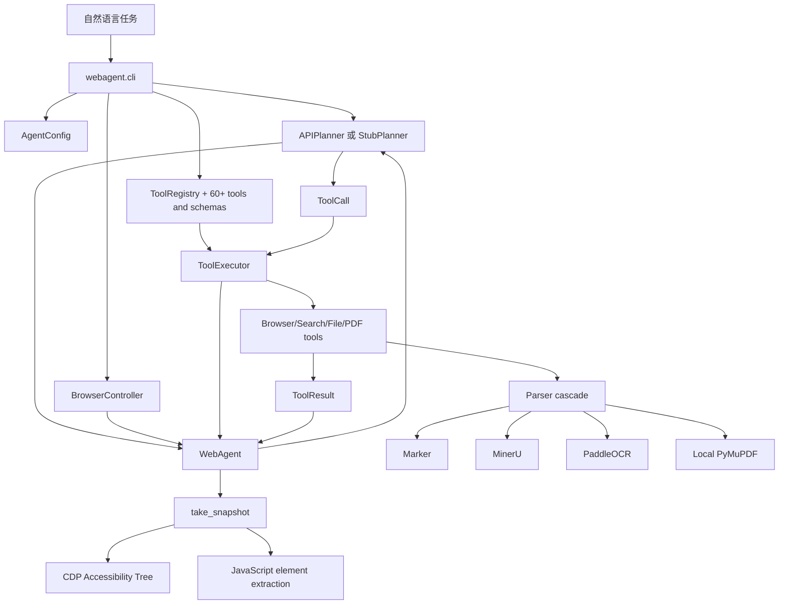
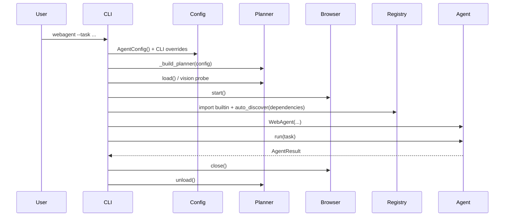
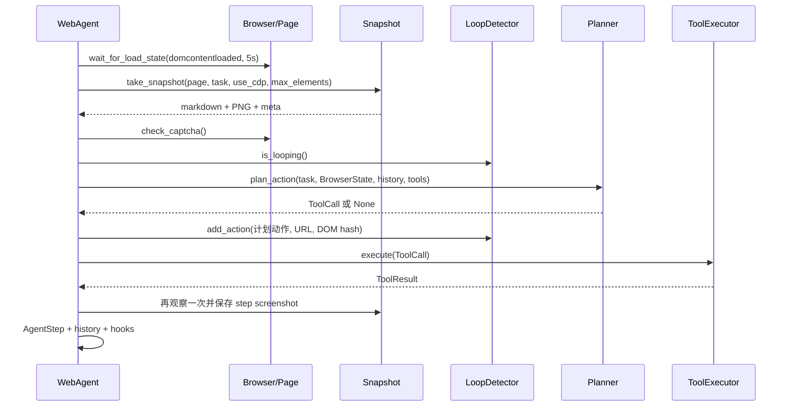
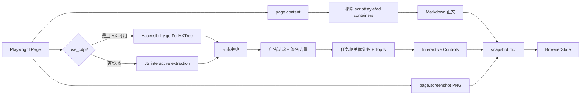
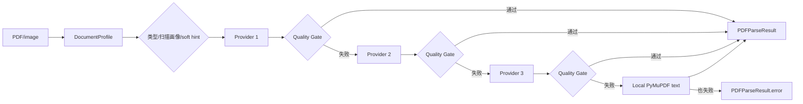

# 架构与数据流

## 模块架构



虚线式“可插拔”关系由 `typing.Protocol` 表达，但 CLI 当前仍显式构造具体的 `BrowserController`、`APIPlanner/StubPlanner` 与 `ToolExecutor`。

## 启动时序



浏览器启动失败时，CLI 会先 `planner.unload()` 再抛 `RuntimeError`；浏览器启动成功后的任何后续结果都由 `finally` 保证关闭 browser 和 planner。

## 单步 Observe–Think–Act–Record



一个容易忽略的事实：loop detector 在 `_think()` 返回后、工具真正执行前记录动作。因此它检测的是“规划重复/页面停滞”，不是严格的“成功执行重复”。

## Browser snapshot 数据流



`snapshot` 返回完整 HTML，但 `_observe()` 只把 Markdown、截图、URL、标题放入 `BrowserState`；完整 HTML 不进入 planner。

## Planner 与 Tool 数据流

```text
BrowserState
  ├─ screenshot -> JPEG quality=70 -> base64 -> image_url（仅视觉可用）
  ├─ dom_summary -> 最多 6000 字符
  ├─ url/title
History -> 最近 N 步文本摘要
Registry -> 每行 name: description
                       ↓
                  model request
                       ↓ raw text
             JSON extraction + aliases
                       ↓
ToolCall(tool_name, parameters, reasoning)
                       ↓
lower-case name -> registry validation -> implementation.execute
                       ↓
ToolResult(success, tool_name, error, data)
```

## PDF cascade 数据流



正常文本 PDF 默认 `Marker → MinerU → Paddle`；扫描 PDF 默认 `MinerU → Marker → Paddle`；单张图片默认 `Paddle → Marker`。配置 `ocr_provider` 只是把已在候选中的 provider 提到第一位。
